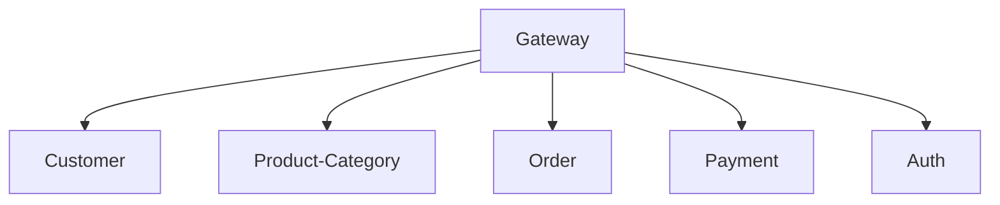
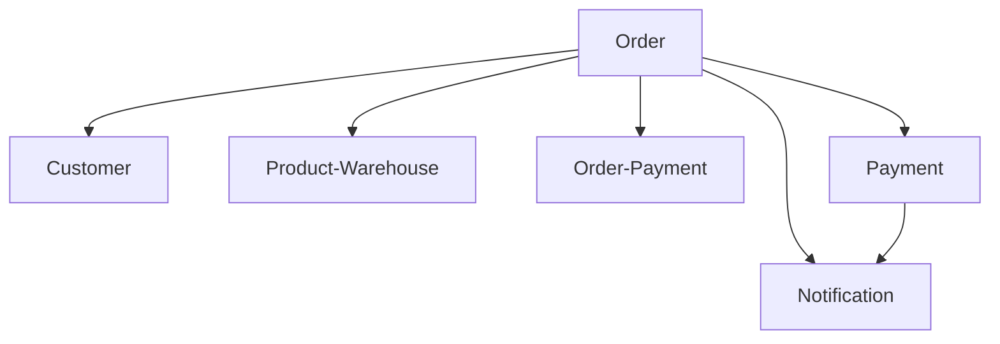

## CMT-MS ports and Access
| service | ip_example |  Image-Port |
| :---------------------------------------------- | :-------------------- |  :----- |
| customer | GatewayIp | 8055 | 
| notification | GatewayIp | 8045 |
| gateway | GatewayIp | 8222 |
| order & order-line | GatewayIp | 8065 |
| payment | GatewayIp | 8060 |
| category & product & product-purchase | GatewayIp | 8050 |

## CMT - Template example relationship

---

---

